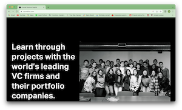
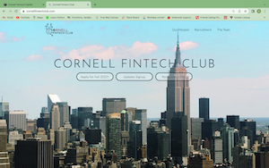
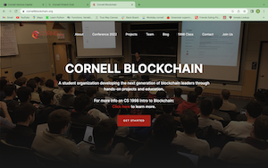
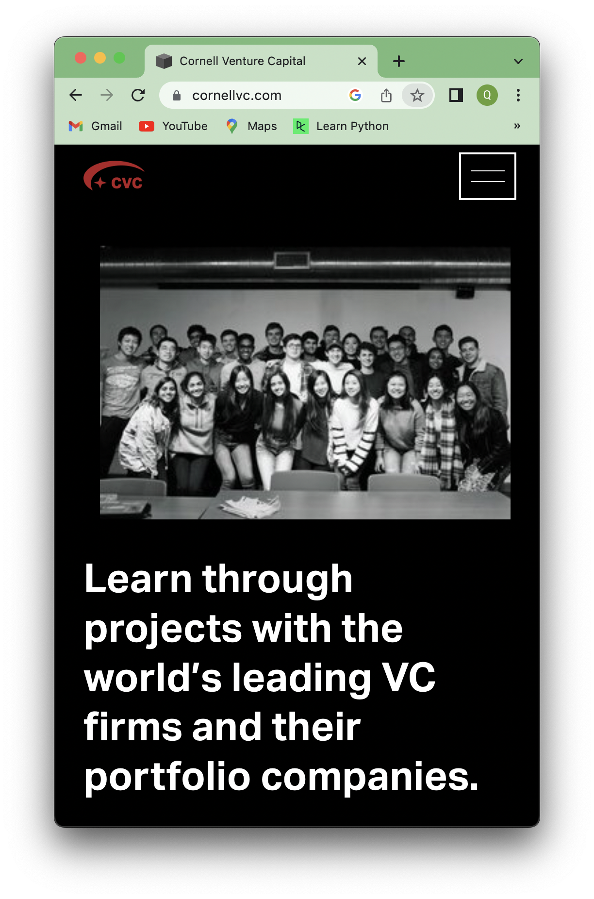
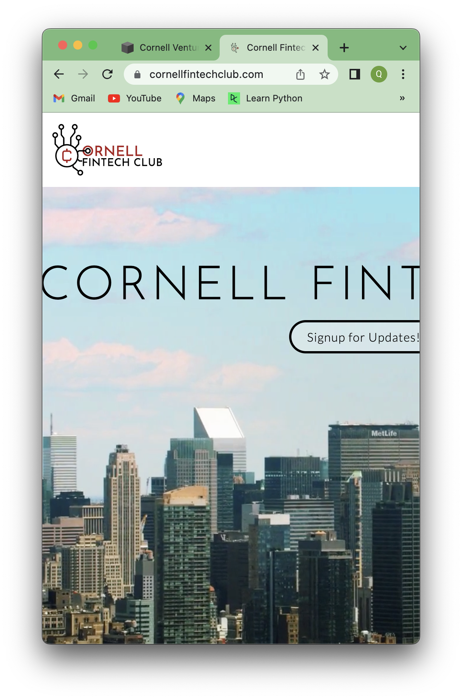
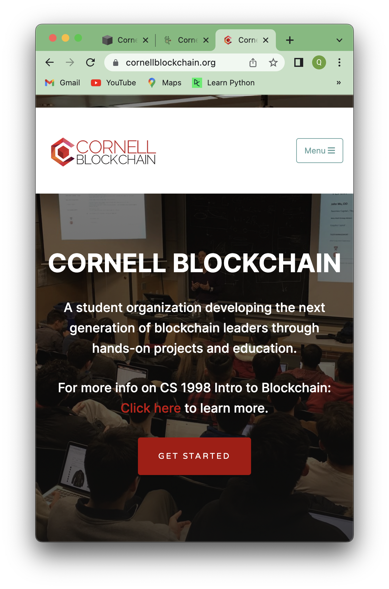
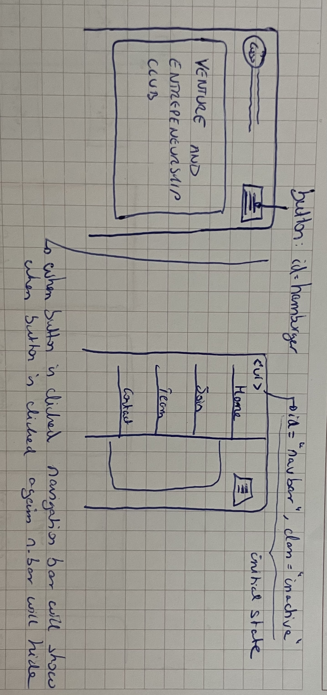
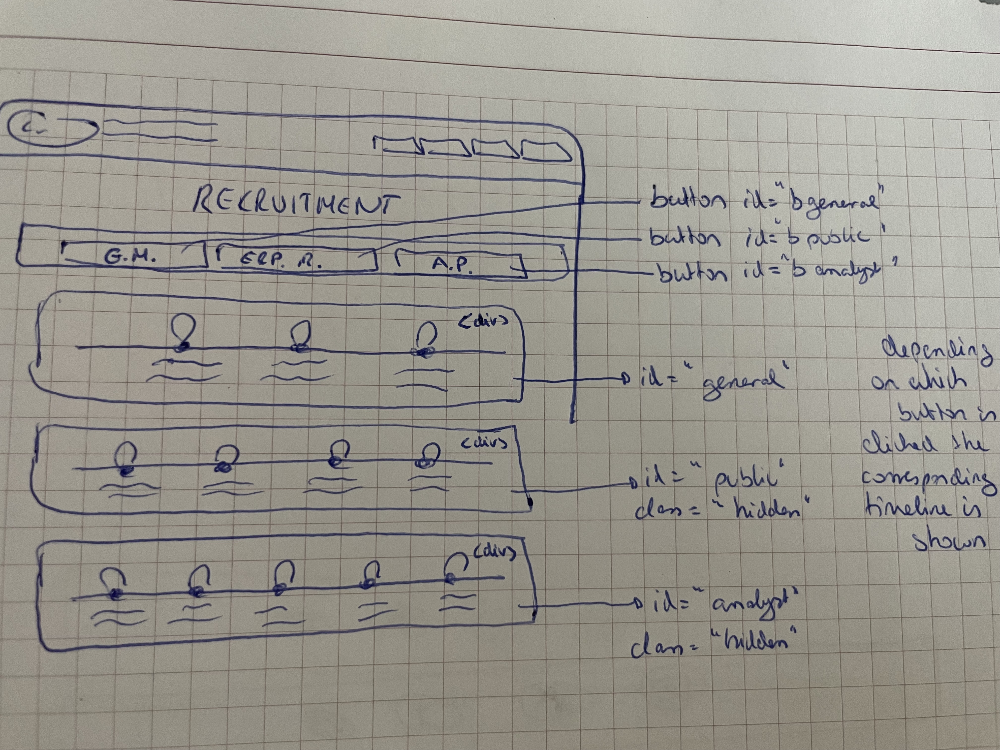

# Design Journey

## Client
### Client Description
Cornell Venture and Entrepreneurship Club (CVEC) is officially registered at Cornell University and is an early/VC/PE investor connecting China and the United States , entrepreneurs, students and scholars of the venture capital community.

### Client Questionnaire

1. Describe your organization and its purpose.

    - connects entrepeneurs, venture capital, investors and students through events
    - provides training
    - fostering community
    - ideas

    CVEC connects entrepreuers, ventures capitals, and students together. CVEC aims to create a community around these people and help these people to create great ideas.

2. What makes your organization or your club unique?

   - unique because: unique community is build

    Because it creates a platform for these diverse groups, provides recourses for these people.

3. Why are you looking for a new website? What is your goal of developing a new website?

    - because in connecting with investors and students it is a good way to show them our organization
    - show them who we are
    - centralice information
    - platform to conect
    - they never actually manage to conect content and design to make a good website

    Had an old one but never came into this place. Website is important to connect investors and startups. Be a portfolio, latest news, who we are, our missions.

4. Who do you want to visit your site? Who do you believe is your website's intended audience?

    - speakers we invite (investors, alumni) --< want to know more about the club
    - students that want to join
    - students who want to find common people with similar interests

    Audience: (1) the guest speakers, such as alunmi (2) The startups (3) The students who want to join the club

5. When visiting your site, what actions do you want your visitors to take?

    - introduction and mission statement --> communicate values
    - who we are section --> what they have done (2 parts: public relation & startups/projects)
    - Porject --> present like portfolio
    - Public relations --> present events
    - Memebers page to introduce members
    - Contact methods as club
    - career section for students/masters

    - browse website and absorve information
    - click on contact links
    - subscribe

    (1)browse the website (2)follow the website linkedin (3)join the email list (4)look for recruitment information

6. What are your goals for this site?

    - show mission and values
    - show structure of the clubs
    - show public relation events
    - show previous porojects (portfolio)

    (1) let the audience know the club value and see the mission statement (2) let the audience to know the members in the club, to know who we are (3)let the audience to know the past events (4) let the aduience to know the structure of the clubs (5) shows contact information as the club

7. Is there a "feel" that you want for your site? Are there colors or imagery that you have in mind?

    - logo
    - main colors: blue, white and black
    - profesional, not warm --> more sharp, clean, straight to the point, cool --> not typical

    Main colors are blue, white, and black. Corresponding to the logo color. Feeling: professional, young, and clean.

8. What are your three favorite competitors or similar organizations' websites? Why?

   1. Cornell Venture Capital --> young, clean, profesional
        <https://www.cornellvc.com/>
       

   2. Cornell Fintech Club --> design
       <https://www.cornellfintechclub.com/>
       

   3. Cornell Blockchain --> design and navigation
       <https://cornellblockchain.org/>
       

9. Are you willing to provide those contents?
    Yes

### Client Website

The client wants a clean, professional yet, still youth website.The website will present startup businesses, potential guest speakers and possible members, with a place to seek information on the purpose of the club, members within the club and also showcase past or future projects.

### Client Goals

(1) let the audience know the club value and see the mission statement
(2) let the audience to know the members in the club, to know who we are
(3)let the audience to know the past events
(4) let the aduience to know the structure of the clubs
(5) shows contact information as the club

### Client Website Scope

Our website will have 3-4 pages. Our client doesn't want the website to be too complicated but want the information to be very straightforward. So a 3-4 pages website works perfect for them.

## Plan/Schedule
We have designed a full planning for the work ahead of us.
<https://docs.google.com/spreadsheets/d/1plbvCZfAgw08oL8tvaC_QB7mTjyoPcqs5mmL9N-RkD8/edit?usp=sharing>

## Understanding Users

### User Interview Questions

**User Interview Briefing & Consent:** "Hi, I am a student at Cornell University. I'm currently taking a class on web design and for a project, I am designing the website for CVEC. I'm trying to learn more about the people that might use this site. May I ask you a few questions? It will take about 10 minutes. You are free to quit at any time."

1. Please tell me a bit about yourself. You may omit any personal or private information.

2. Have you ever heard about the Cornell Venture and Entrepreneurship Club?
   2.1. If NO: Would you like to seek out information about this Club?
        2.1.1. If YES: What information are you specifically looking for? How are you thinking of accessing that information?
        2.1.2. If No: Why not?
   2.2. If Yes: Did you seek out any information about the club when you first heard about it?
        2.2.1. If YES: What information were you specifically looking for? Did you find it? How did you access that information?
        2.2.2. If No: Why not?

3. Have you ever though about applying to join a club at Cornell?
   3.1. If YES: what information do you seek out for and where do you look for that information
   3.2. If not: imagine you would like to apply to cornell venture and entrepeneurship club. What information would you seek for and where?

4. Have you ever attended one of the venture and entrepenuership club organized events?
   If NO: iamgine you would attend one of their events

   4.1. Before you went to the event, did you seek out any information about the event before getting there?
    4.1.1. If yes, What information were you specifically looking for? Did you find it? How did you access that information?

   4.2. When you arrived at the event, did you seek out any information about the event?
    4.2.1 If yes, What was that information? How did you obtain it?

   4.3. After having visited the event, do you feel that there is some information you would have liked to know before arriving?
    4.3.1. If yes, what type of information?
    4.3.2. If no, why not? Do you feel you already posses all the necessary information? Where did you get that information?

5. Have you heard about the CVEC's newletter?
   Would you like to know more about it? If yes, what specific information?

6. What haven't I asked you today that you think would be valuable for me to know?

**After the interview:** "This was really helpful. Thank you so much for agreeing to speak with me today. Have a great day!"

### Interview Notes

**Interviewee 1:**

Our first interviewee is a Cornell junior majoring in Information Science.

1. Please tell me a bit about yourself. You may omit any personal or private information.
   Answer: Hi! I am now a junior student at Cornell University. My major is Information Science.

2. Have you ever heard about the Cornell Venture and Entrepreneurship Club?
   2.1. If NO: Would you like to seek out information about this Club?
        2.1.1. If YES: What information are you specifically looking for? How are you thinking of accessing that information?
        2.1.2. If No: Why not?
   2.2. If Yes: Did you seek out any information about the club when you first heard about it?
        2.2.1. If YES: What information were you specifically looking for? Did you find it? How did you access that information?
        2.2.2. If No: Why not?
    Answer: I didn't hear about this club before. But I would love to know more about it since I am generally inetested in business. I don' have specific information in mind that I want to look for, I am interested in this club in general.

3. Have you ever thought about applying to join a club at Cornell?
   3.1. If YES: what information do you seek out for and where do you look for that information
   3.2. If not: imagine you would like to apply to cornell venture and entrepeneurship club. What information would you seek for and where?
   Answer: I will think of applying if I like this club's mission and culture. I think I would go to this club's website and browse to seek for the info I need.

4. Have you ever attended one of the venture and entrepenuership club organized events?
   If NO: inagine you would attend one of their events
   Answer: No I haven't.

   4.1. Before you went to the event, did you seek out any information about the event before getting there?
    4.1.1. If yes, What information were you specifically looking for? Did you find it? How did you access that information?
    Answer: I would seek out the time, format, and theme of the event.

5. Have you heard about the CVEC's newletter?
   Would you like to know more about it? If yes, what specific information?
   Answer: No I haven't heard about the CVEC's newsletter, but I would love to suscribe to its newsletter to know more about its event.

6. What haven't I asked you today that you think would be valuable for me to know?
   Answer: No I think. Thanks!

**Interviewee 2:**

Our second interviewee is a Cornell exchange student double majoring in Information Science and Business.

1. Please tell me a bit about yourself. You may omit any personal or private information.
   Gonzalo Sainz de Aja, exchange student from Madrid, is studying at Cornell for the fall semester, double majoring in information science and business, loves to play basketball, joined the Consulting club at cornell.

2. Have you ever heard about the Cornell Venture and Entrepreneurship Club?
   2.1. If NO: Would you like to seek out information about this Club?
        2.1.1. If YES: What information are you specifically looking for? How are you thinking of accessing that information?
        - general info about the club, access through the internet --> seek for website

3. Have you ever though about applying to join a club at Cornell?
   3.1. If YES: what information do you seek out for and where do you look for that information
    - go to the club fest at ask in person
    - recruitment process
    - education in the club
    - projects they work on

4. Have you ever attended one of the venture and entrepenuership club organized events?
   If NO: iamgine you would attend one of their events

   4.1. Before you went to the event, did you seek out any information about the event before getting there?
    4.1.1. If yes, What information were you specifically looking for? Did you find it? How did you access that information?
    - what the event is about
    - where and when

   4.2. When you arrived at the event, did you seek out any information about the event?
    - NO

   4.3. After having visited the event, do you feel that there is some information you would have liked to know before arriving?
    4.3.1. If yes, what type of information?
    - duration of the event

5. Have you heard about the CVEC's newletter?
   Would you like to know more about it? If yes, what specific information?
   - no, but would like to know more about it, specifically frequency which they send it and what information they have in the letter

6. What haven't I asked you today that you think would be valuable for me to know?
   Nothing

**Interviewee 3:**

1. Please tell me a bit about yourself. You may omit any personal or private information.
   Answer:
   Name: Madelyn Godfrey
   Sophmore Cornell University
   Psychology Major
   Favorite Artist: Giveon
   Color: Blue

2. Have you ever heard about the Cornell Venture and Entrepreneurship Club?
   2.1. If NO: Would you like to seek out information about this Club?
        2.1.1. If YES: What information are you specifically looking for? How are you thinking of accessing that information?
        2.1.2. If No: Why not?
   2.2. If Yes: Did you seek out any information about the club when you first heard about it?
        2.2.1. If YES: What information were you specifically looking for? Did you find it? How did you access that information?
        2.2.2. If No: Why not?

    Answer: No she has not heard of the club. Yes she would like to seek out information on the club. She would go to the instagram or website for answers looking for  how to be an entrepreneur and what resources does the club have.

3. Have you ever though about applying to join a club at Cornell?
   3.1. If YES: what information do you seek out for and where do you look for that information
   3.2. If not: imagine you would like to apply to cornell venture and entrepeneurship club. What information would you seek for and where?
    Answer: Yes, Seeks out their mission statement. What goals, asperations the club has and how does it serve its members. She would look online (website) or instagram.

4. Have you ever attended one of the venture and entrepenuership club organized events?
   If NO: iamgine you would attend one of their events

   4.1. Before you went to the event, did you seek out any information about the event before getting there?
    4.1.1. If yes, What information were you specifically looking for? Did you find it? How did you access that information?

   4.2. When you arrived at the event, did you seek out any information about the event?
    4.2.1 If yes, What was that information? How did you obtain it?

   4.3. After having visited the event, do you feel that there is some information you would have liked to know before arriving?
    4.3.1. If yes, what type of information?
    4.3.2. If no, why not? Do you feel you already posses all the necessary information? Where did you get that information?
    Answer: No she has not.

5. Have you heard about the CVEC's newletter?
   Would you like to know more about it? If yes, what specific information?
    Answer: Never heard of the newsletter. Yes she would like to hear more. Want know about upcoming events.

6. What haven't I asked you today that you think would be valuable for me to know?
    Answer: Loves to hear or browse personal stories to see how the club has impacted past or current members. Was the enivornment welcoming,wwhat they liked about the club, how was it benefical to where they are today.

### Goals
Goal 1: Discover what the Cornell Venture and Entrepeneurship is.

- **Design Ideas and Choices**
  - In order to meet this goal we are going to quickly and easily provide the key information about the club to the audience. It will be presented in a concise and easy to find maner, that everyone will understand and find without problem. Furthermore the design of the website will convey the main aspects that represent the club including professionalism and innovation.
- **Rationale & Additional Notes**
  - This first goal is mostly informative and the audience will want to access this information rapidly and without having to look long to find it, so presenting it in an concise and quick way will help fulfill this goal. In addition the professionalism and innovation feeling will be conveyed through sharp and clean designs embodied in the clubs colors.

Goal 2: Get to know the team memebers of the club and contact them for more information

- **Design Ideas and Choices**
  - My design will focus on presenting the teammebers in a clear and dynamic  way with a clear link to each contact information. That way the user will be able to fulfill its goal being guided by the deign and content found in the website.
- **Rationale & Additional Notes**
  - The content is going to be key for the fullfilment of this goal as well as the way that content is presented. Showing it in a dynamic way accompanied with pictures will help the user absorb the information quicker and thus meet their goal.

Goal 3: Be guided through the recruitment process and find out what they have to do to apply to the club.

- From the interviews we concluded that the audience also wants to be guided through the recruitment process. Thus I will inlcude some guides about it in order to help my audience enjoy the process to the fullest. They will be designed in a easy to follow way with different options so that the audience can use it without encountering any problems. Furthermore once again I will use the design to focus on emotions that accompany their experienced lived through the process.

### Audience

Cornell undergraduate and graduate students. They are a choesive group with regard to the Cornell Venture and Entrepeneurship club due to the fact that they all attend Cornell and may be interested in getting to know the club or even apply to it.They all represent common goals when visiting the clubs website and are thus a perfect audience for the website.

## Website Design Exploration

**We'll refer to these as our "example websites."**

1. <https://www.cornellvc.com/>

    
    

2. <https://www.cornellfintechclub.com/>

    
    

3. <https://cornellblockchain.org/>

    
    

### Example Website 1 Review

Cornell Venture Capital Club Website

One design feature that cornell venture capital implement that I think is neat is using the logo that is located at the top left to take users back to the home page. Another is that they use a form on the contact page that allows users to put in their name, email, subject and a message. This layout make the page look extremely proffessional and also makes contacting the club about any inquiries a little bit easier. Some other small features inlude the usage of a pointer finger when hovering over button and the text mouse for input forums. Overall the website is very nice.its color story of black, white,grey and red work to highlight different sections, helping the site look very organized. In viewing this site the one negative is that I do see a lot of blank space therefore that something to look out for in our own website.

### Example Website 2 Review

Cornell Fintech Website

The first thing about this website that I noticed is a feature that is shared with the Cornell Venture Capital website and that is the logo that acts as a button taking users back to the home page of the webiste. In fact this website doesn't have a home website and instead relies on the logo to act as a go between for th home page and others. It does have a footer which contains content like email, location of club, social media and navigation. I like the usage of color-red, white and black( same as logo)- , and the way they organize the site with a fixed navigational bar at the top of the page. When thing about affordances, feedback, etc. some things that stand out are navigation changing colors when hovered above, buttons backgronud color changing, buttons that link to different websites. Its very nice but there was no responsive or mobile version of this site.

- Pointer change for the pictures which goes to each members
- Visually I like that the pictures from members are presented circularly it makes it more visually appealing espically since the logo for the group is circular in itself.

### Example Website 3 Review

Cornell Blockchain

The first thing I saw on the site was the background image and navigation. If using a background image its important to be cognizant of the color of your index.html(home) page because if not the background can over power the navigation making it unreadable. Some of the features within the pages that we felt were strong was the display of logo for where member have gone to work because it lets potential members know that this club is serious and is a great resources for moving on to top corperations whether that be through alumni connection or intellect gained. One thing that stuck out is that though this website had many pages many of the navigational links just took you to a portion of the home page where the information had already previously been display. For example projects, takes you to a portion of the home page where projects the the club does is displayed.
The links within the page are not traditional the are grey where does stand out form the white coloring. Also buttons do hover with the pointer finger but there is no huge feeback like a backgound color change to let users know what element they are on.

## Content Planning

Home Page

- A large picture
- Club logo and club name
- Mission statement
- Club introduction to introduct what CVEC does: Insight Series, Startup Development, Pitch Day Event.
- CVEC's partners.
- Contact information

Members info page:

- Leadership introduction
- Leadership group photo
- Events team introduction
- Events team group photo
- SD introduction
- SD team group photo
- Marketing team introduction
- Marketing group photo
- Contact information

Recruiting page:

- Recruiting timeline
- Contaction information

### Content Justification

These contents address our audience goals. First, on the home page, there are CVEC's name, mission statements, and their featuring events. These contents can give both the students at Cornell as well as potential startups a very quick but comprehensive understanding about CVEC. On the team page, there are introductions to each team and a group photo, which can introduct CVEC to our audience. Then, on the recruitment page, Cornell students can find recruitment process and timeline.

## Information Architecture

### Content Organization

In this iteration of card sorting there are 4 pages. A Home, Team, Join and Contact. These three sections made sense to the team becasue these each contain three different key piece of information that someone my seek. The home page contains the mission statement so that when logging onto the site people can see the amazing goals of the club. As well as a preview to some of the work. Team is essentially to meet the E-board and get a grasp of the organization of the club because it runs simularly to a company with differents departments and department heads. Join is there to provide easy information on how to become a member and contact.

This iteration contains 3 pages. Team, Home, and Join with a footer at the bottom of each page that contains contact information, socail media information, linked in, location etc. We were contemplating taking away the contact page due to it being repetitive if we already have a footer.

This iteration of card sorting contains both a footer and contact page. This made sense to us because while people usually find contact information in the footer for quick access it might be more efficent and smart when thinking about outside potential clients or partners from start-ups that contact be placed at the top.

### Final Content Organization

This iteration of card sorting makes sense for our audience because if you are someone who is looking to join the club, or a partner company it organizes the information so that what you are looking for is very easy to access. Questions about how to get into the club, who to contact, how the club operates or who is in the club is automatically answered through these sections. I think the names of the pages are familiar to the people much as an icon would be so, they know what to expect under each section.The one thing the seperated out card sorting was the question of if to add a contact page and footer. Ulimately we think for the professional, clean look that we should utilize both .

### Navigation

- Home (the logo icon)
- Team
- Join

The name of home page makes sense because there are some basic introduction to the club, including mission statement and the most important events that CVEC holds. The name of team page also makes sense because this page is about the team members. The name of the join page also makes sense because this is about the recruitment information and timeline.

## Visual Theme

1. Clean and professional
2. Clean and cool
3. Innovative and energetic

We ended up selecting the first visual theme for our site, which is clean and professional. It is suitable for our client because our client is a business club, which fits the feeling of professional and clean. We were also provided with the client's logo. The logo also gives us a feeling of professional and clean. So we chose the first visual theme at last.

## Design

## Interactivity Brainstorm

- Navigation bar --> hamburguer menu for narrow screen
  In order to optimize the narrow design, we decided to change the navigation bar to a hamburger menu. This way the design will be more adapted to the user and the space will be optimized. Hamburguer menus are commonly used and the user will know how they work and what they are for.
- What we do --> in carrusel form
  Instead of presenting the audience right away with all the information we beleive it may be wise to show them what the club does in an orderly manner, showing it through a slideshow. This way the user will be able to concentrate on the information they are presented with and dynamically interact with the website to get more information.
- Recruitment timeline subnavigation --> depending on the position a different timeline is shown.
  In order to show the audience how the recruitment process changes depending on the position they want to apply we have included a subnavigation that will change the timeline acccording to the choice. This will help the user get familiar with all types of recruitment processes and will make them clear that there are differences between the processes. Their goal to get to know the recruitment process is further supported.

### Final Design

**Narrow (Mobile) Design:**

This sketch made sense to the team because the side sliding navigation allows for the navigation to be hidden until someone wants to go to a different page and more space for content. It highlight the mission statement as its directly under the title. Mission statement was emphasized during client interviews plus gives users fast access to examples of the clubs inner workings and projects without the page feeling crowded.Then the footer with contact information.

This design made sense becasue the e-board is placed at the top. This is essential becasue like described before the organizational structure of this club does remind me of a company and knowing who to speak to about issues and inquiries is important. Next the individual teams are listed in a column with their name and description above. Then the footer with contact information.

This desgin made sense because it provides potential members with information on the the specific roles that they may join  for. I makes navigating the information straight foward and easy.

**Wide (Wide) Design:**

This sketch made sense becasue it fills the wide screen without making it feel crowded. The navgation that was once a sliding side bar is plced horizontally in the header to fill empty space creating a clean look. Plus the orgainzation of the boxes and text is aesthically pleasing.

The difference between the narrow and wide screen version of this is the display of the different teams information. This change just allows for the filling of empty space.

This is the same as the narrow screen it works becasue it provides all the information in a very cool and clean way.

### Design Rationale

Our content organization is very clear and each page has its clear function and can satisfy one of our client's goal. Our navigation is very comprehensive and can lead to every other pages. Our layout combines the horizontal and vertical flex boxes display very reasonably. We also use design patterns such as navigation, footer, recruitment timeline, banner that our audience are very familiar with to improve familiarity of the site.

## Interactivity Rationale

We have proposed three different interactivities that we believe will help our audience meet their goals. However when going over the three we decided to implement only 2 of the three proposed in order to meet our audience goals. First of all we have converted the navigation bar into a hamburguer menu when narrowing the screen. The user will be able to still easily navigate through the pages without being disturbed by the navigation bar. The main goal of the user is to get information about the club and thus optimizing the space to present the user with the information they are interested in is key. Through the hamburguer menu we are achieving that and thus helping the user meet their goals.  The last interaction included is a submenu which helps the user find the information they are looking for quickly and in an efficient manner. Users will be able to identidy through the interactions the theree different options they have to join the club and analyze the different recruitment processes.

## Interactivity Plan

Hamburger menu:

pseudocode:
when #hamburger is clicked:
    if #navbar has Class .inactive {
        remove .inactive from #navbar
        add .active to #navbar
    } else {
        add .inactive to #navbar
        remove .active from #navbar
    }

Submenu:

pseudocode:
when bgeneral is clicked:
    add Class .hidden to #public;
    add Class .hidden to #analyst;
    remove Class .hidden to #general;

when bpublic is clicked:
    remove Class .hidden to #public;
    add Class .hidden to #analyst;
    add Class .hidden to #general;

when banalyst is clicked:
    add Class .hidden to #public;
    remove Class .hidden to #analyst;
    add Class .hidden to #general;

## Client Feedback

Who did we meet with? Kevin Sheng
Role: CVEC Events Chair
note to self: Ada couldn't make the meeting.

- Principle  Link to the home page added to the logo
    Fonts are all over the place hone in on them. Keep compact page.
- Add form for contact page, have a big contact page;
    (Same information different layout maybe QR CODE, contact person for the club)

- color Theme is really good blue white and black;
    Bolden name and center

    -Thinks it would be smart to add a seperate page for past events,  Maybe think of a calender, check out a interactive calender for people to see events.

    -Calender on Home Page

## User Testing

### User Testing Tasks

1. Use one sentence to briefly describe who is CVEC and what is does.

2. Follow CVEC's Instagram.

3. Find out the email contact of CVEC.

4. Find out the time for info session and the deadline for online application for Analyst Program.

### Participant 1

1. Who is your user, e.g., where does the user come from, what is the user's job, characteristics, etc.?

    She is a junior Cornell student majoring in Information Science. She is generally interested in joining Cornell clubs.

2. Does the user belong to your audience of the site?

    Yes.

For the first task, user scrolled down the home page and browse the contents on the home page. Then she told me the mission statement of the club. But the mission statement is a bit too long to her so she must looked at the screen while saying the mission statement.
For the second task, she scrolled down to the bottom and clicked at the Instagram logo. After the page jumped to the Instagram, she followed it. For the third task, she also found the email contact of CVEC at the footer when she scrolled down to the bottom of the home page. For the fourth task, she clicked to the join page, and clicked the button of analyst program. From there, she told the time of info sessions and deadline of application.

### Participant 2

1. Who is your user, e.g., where does the user come from, what is the user's job, characteristics, etc.?

    Sophie, She is a senior studying information science at cornell. Captain of the cornell polo team. Is really engaged in cornell activites.

2. Does the user belong to your audience of the site?

    Yes

3. He correctly  scrolls down through the home page and finds the appropriate information
4. Quickly finds Instagram, is correctly redirected to instagram page --> Suggestion open window in a new tap as it was not intuitive how to go back to page
5. goes to footer because he guesses the contact info is there (familiarity), Quickly locates it
6. Navigates intuitively to join page. Correctly knows how to use buttons and locates necessary information.

### Participant 3

1. Who is your user, e.g., where does the user come from, what is the user's job, characteristics, etc.?

   Kelley Perez,from Maryland , Sophmore at cornell studying Bio and Society , outgoing

2. Does the user belong to your audience of the site?

    Yes

Participant looks at the tasks

Started with task 4:
Goes to home and scrolling down. Looking to see if its on first page states "Usually where announcements are"
User scrolls up and clicks on join, quickly clicks on Analyst program button. Asks for clarification on which info session, (Can't answer) Provides answer part 1 Friday 5pm-6pm and part 2 Monday 5pm-6pm both virtual.

Task 3:
User goes to takes out her phone... clicks on home page, proceeding to scroll down. Seems to be reading the content. Scrolls to the bottom and locates email on the bottom left side of the footer.

Task 1:
On  home footer. Scrollls up to mission statent. Proceeds to read off Mission statement.

Task 2:
Takes out cellphone.Returns to the laptop. Clicks on join, scrolling, goes to bottom once again locating footer finds the instagram icon, clicks.

## Website Revision Based on User Testing
> What changes did you make to your design based on user testing?

1. We adjusted the margin of the team introduction part.
2. We removed the light blue background of the buttons on the recruitment page. We decided to stick with the three main color, and decided not to use a fourth color.
3. We changed the font og the team page to make it consistent with the other two pages.
4. We added the link to the home page to the logo.

### Collaborators (Final Submission)

Quanay, Marta, and Jane worked together on this project. Cornell Venture and Entrepreneurship Club also gave us feedback and helped to provide the materials that we need.

### Reference Resources (Final Submission)

W3Schools, StackOverflow, Mozilla.
